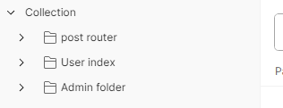
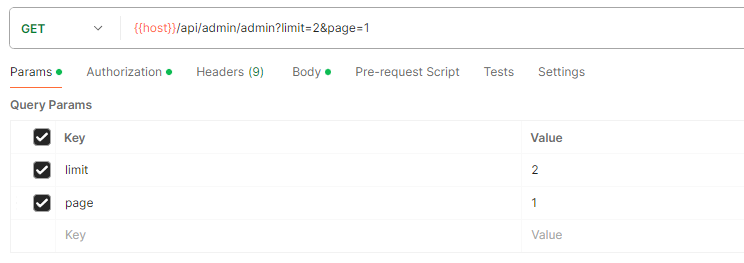
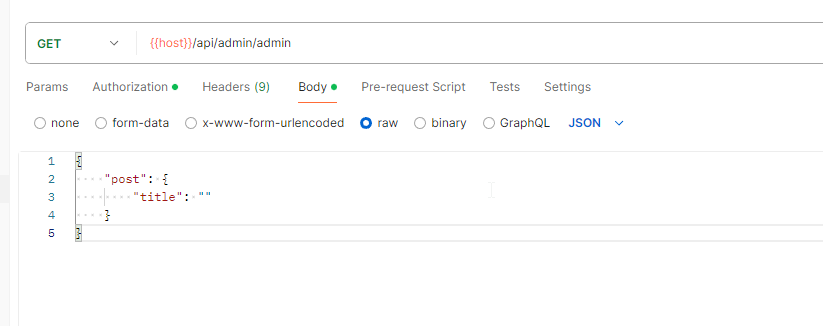
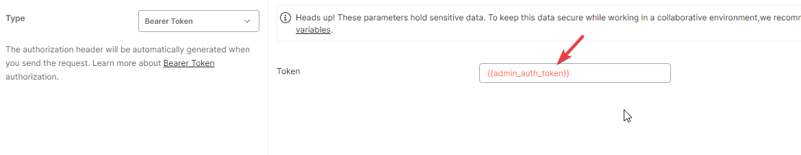

# FastPostmanCollection

This library helps you generate a Postman collection from your Phoenix router (`MyApp.Router`).
You can document your endpoints using `@doc` annotations for **params, body, form data**, and more.
Pipelines (plugs) can also be auto-scanned and added to the collection automatically.

Example generated collection:



This library uses the official Postman schema: https://schema.postman.com/

## Table of Contents

- [Installation](#installation)
- [Configuration](#configuration)
- [Controller Example](#configure-your-controller)
- [Description and Titles](#description-and-title-of-collection)
- [Query Parameters](#params-in-your-collection)
- [Body Parameters](#body-parameters)
- [Form Data](#formdata-options)
- [Authentication Tokens](#how-to-auto-scan-and-autoput-your-pipes-token)
- [Organizing Folders](#organizing-folders-in-the-collection)
- [Mix Commands](#mix-commands)
- [Todo](#todo)
- [Feedback](#you-like-the-idea)
- [Changelog](#changelog)

## Installation

If [available in Hex](https://hex.pm/docs/publish), the package can be installed
by adding `fast_postman_collection` to your list of dependencies in `mix.exs`:

```elixir
def deps do
  [
    {:fast_postman_collection, "~> 0.1.8"}
  ]
end
```

Configure fast_postman_collection

- router -> your Phoenix router module *(required)*
- pipe_tokens -> put in your auth bearer (`pipe_tokens`: a list of pipeline plugs (like `:admin_auth`) that should automatically add a Bearer token in the Postman request headers.)
- variables -> variables to include in the Postman collection *(optional)*
- file_path_collection -> path to save the generated collection *(optional)*

```elixir
config(:fast_postman_collection,
  pipe_tokens: [:admin_auth, :user_auth],
  name_collection: "My collection",
  router: MyApp.Router,
  variables: [
    %{
      key: "host",
      value: "http://localhost:4000"
    }
  ]
)
```

When you add router to your configuration, it will be able to generate a collection _using the command_ - `mix fs.get_collection`


## Description and Title of collection


```elixir
@moduledoc """
# Post Controller
This will be used as the folder name in the generated Postman collection.
"""

@doc """
# Create Post
This will be used as the request title in the Postman collection.

Use this endpoint to create a new post.
All content inside this doc block will be added to the request description in the collection.
"""
```

If you don't provide a `@doc` annotation, the default name will be taken from the module or function name.

## Params in Your Collection

These parameters will be included in the URL as query strings.
For example, the generated URL might look like: ?limit=0&page=1

```elixir
@doc params: %{
  limit: 0,
  page: %{
    key: "page",
    value: 1,
    description: "Page number for pagination"
  }
}
def index(conn, params) do
  json(conn, params)
end
```



## Body Parameters

These parameters will be included in the request body.
By default, the body is sent in JSON format.

This is how you define a request body in JSON format:

```elixir
@doc """
# Create post
"""
@doc body: %{
        post: %{
          title: ""
        }
      }
def create_post(conn, params) do
  json(conn, params)
end
```



## Formdata options

To send form data (e.g. file uploads):

```elixir
@doc mode: "formdata"
@doc formdata: [
        %{
          key: "image",
          value: nil,
          type: "file"
        }
      ]
```

## How to Auto-Scan and Apply Authentication Tokens

How to auto scan and autoput your pipe's token

### Example

router.ex

```elixir
scope "/user" do
  pipe_through(:admin_auth)
  get("/", UserController, :index)
end
```

config.exs

```elixir
config(:fast_postman_collection,
  pipe_tokens: [:admin_auth, :user_auth]
```

All tokens puts and scans from your pipelines



### Extract Token from Response Automatically

You can also automatically insert tokens into variables from a response:

```elixir
 @doc auth_pre_request: %{is_enabled: true, from_resp_token: "token", variable_token: "admin_variable"}
```

## Organizing Folders in the Collection

You can use @moduledoc folder_path: "Admin" to place your module's requests inside a specific folder in the Postman collection.

The final folder structure will look like:
Admin / UserController

#### Example

```elixir
defmodule MyAppWeb.AdminUserController do
  use MyAppWeb, :controller
  @moduledoc folder_path: "Admin"
  # this module puts to /admin/user controller
  @moduledoc """
  # user controller
  """

end
```

## Mix commands

- mix fs.get_collection: _This command generate in your directory file with collection_

## Todo

- [ ] filtering in mix fs.get_collection

## You like the idea?

If you like the idea of the library, write in this "issue" on github and I will add this functionality as soon as I have free time.

## Changelog

- 0.1.8: Exclude null entries in Request Header, fix for full paragraph and update documentation for library
- 0.1.7: Added support for including endpoint descriptions in Postman collections
- 0.1.6: Previous version
